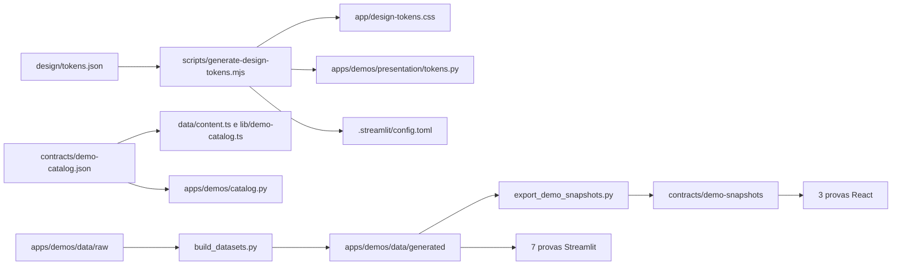

# Arquitetura

## Decisão central

Landing, demos, contratos, datasets e documentação vivem em um único
repositório. O Next.js permanece na raiz para não introduzir configuração
especial na Vercel; o aplicativo Python vive em `apps/demos/`.

```text
portfolio-lucas-batista/
├── app/                         rotas Next.js, sitemap e robots
├── components/
│   ├── demos/                   modal e provas React
│   ├── sections/                seções da homepage
│   ├── layout/                  estrutura compartilhada
│   └── ui/                      primitives mínimos
├── data/content.ts              conteúdo editorial
├── apps/demos/
│   ├── app.py                   entrypoint Streamlit
│   ├── catalog.py               leitor do catálogo JSON
│   ├── domain/                  cálculo sem dependência de UI
│   ├── presentation/            tema, charts, mapas, tabelas e formatadores
│   ├── pages/                   composição de cada prova
│   ├── data/raw/                amostras curadas
│   ├── data/generated/          datasets determinísticos
│   ├── scripts/                 geração, export e smoke
│   └── tests/                   pytest
├── contracts/
│   ├── demo-catalog.json        identidade e publicação
│   └── demo-snapshots/          dados das âncoras
├── design/tokens.json           tokens editáveis
├── scripts/                     automação transversal
├── tests/e2e/                   Playwright
└── .artifacts/                  saídas locais ignoradas
```

## Fluxos de dados



## Next.js

- `app/page.tsx` possui o `<main id="conteudo">` da homepage.
- `app/provas/[slug]/page.tsx` gera somente os 3 slugs âncora.
- `app/sitemap.ts` e `app/robots.ts` substituem arquivos estáticos gerados.
- `data/content.ts` é importado por Server Components; Client Components recebem
  props mínimos.
- `CaseDemoLauncher` carrega `DemoModal` apenas no primeiro clique.
- ECharts e MapLibre são importados dentro de `useEffect`, quando a prova abre.
- No mobile, iframe Streamlit só monta após ação explícita do usuário.

## Streamlit

`apps/demos/app.py` usa `st.navigation` e `st.Page`. As URLs são explícitas e
derivadas do catálogo compartilhado. Pages devem apenas compor filtros,
apresentação e chamadas ao domínio.

Dependências entre camadas:

```text
pages → domain
pages → presentation
presentation → settings/tokens
domain ↛ streamlit
```

## Contratos

`DemoSnapshot` é produzido pelo Python e validado no TypeScript. React não
recalcula frete, SLA ou roteirização. Alterações de schema exigem:

1. atualizar exporter e tipos;
2. rodar `npm run demos:export`;
3. rodar `npm run demos:validate`;
4. revisar as 3 rotas públicas.

## Artefatos

| Artefato                   | Destino                       | Git |
| -------------------------- | ----------------------------- | --- |
| CV final                   | `public/lucas-batista-cv.pdf` | sim |
| export intermediário do CV | `.artifacts/cv/`              | não |
| capturas Playwright        | `.artifacts/qa/`              | não |
| relatórios Lighthouse      | `.artifacts/lighthouse/`      | não |
| resultados Playwright      | `.artifacts/playwright/`      | não |

Legado removido continua recuperável no histórico Git. Clones e relatórios
locais antigos são arquivados fora do repositório.

## Proteção contra regressão

`scripts/validate-architecture.mjs` exige a topologia acima e falha se caminhos
legados reaparecerem. A decisão completa está em
`docs/decisions/0001-single-repository.md`.
