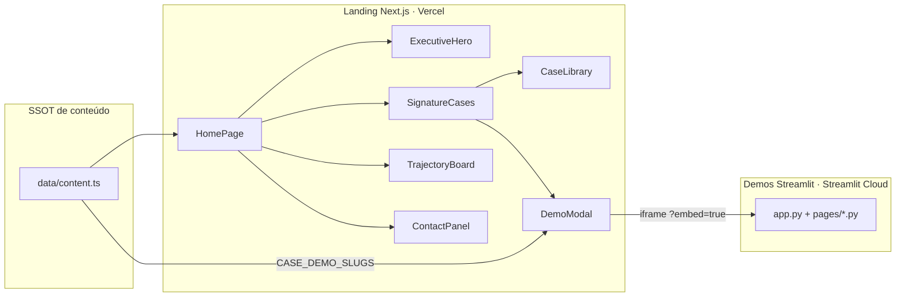

# Arquitetura — Portfólio Lucas Batista

> **SSOT de arquitetura.** Complementa [`CANON.md`](CANON.md) (entrada única) com o mapa estrutural do sistema.
>
> **Última atualização:** 13/07/2026 — pós-refinamento de cases (thumbnails reais, filtros dinâmicos, modal progressivo).

---

## 1. Visão do sistema



| Serviço | Repo | Deploy |
|---------|------|--------|
| Landing | `portfolio-lucas-batista` | Vercel |
| Demos | `demos-logistica` (sync a partir de `demos-logistica/`) | Streamlit Cloud |

---

## 2. Ordem canônica da homepage

DOM = nav = spec. Fonte: `components/HomePage.tsx`.

| # | Seção | ID | Componente | Função |
|---|-------|-----|------------|--------|
| 1 | Header | — | `Header` + `MobileNav` | Nav + CTA contato |
| 2 | Hero | — | `ExecutiveHero` | Nome, fit, CTAs, stack/empresas |
| 3 | Provas rápidas | — | `EvidenceStrip` | **3** métricas de impacto |
| 4 | Perfil | `perfil` | `ProfileBrief` | Fit em 60s (sem FAQ) |
| 5 | Provas | `cases` | `SignatureCases` → `CaseLibrary` + roadmap | 3 âncora + 7 biblioteca + 1 roadmap |
| 6 | Trajetória | `trajetoria` | `TrajectoryBoard` | Experiência, formação, certs, idiomas |
| 7 | Contato | `contato` | `ContactPanel` | LinkedIn, email, GitHub, CV |
| 8 | Footer | — | `Footer` + `BackToTop` | Links e declaração |

Nav: **Perfil · Provas · Trajetória · Contato**.

---

## 3. Árvore de montagem

```
HomePage
├── Header → MobileNav
├── ExecutiveHero
├── EvidenceStrip
├── ProfileBrief
├── SignatureCases
│   ├── CaseThumbnail (WebP real nos 3 âncora)
│   ├── CaseDemoLauncher → DemoModal (lazy)
│   ├── CaseLibrary (filtros só com count > 0)
│   └── Roadmap (06-kpis-cd)
├── TrajectoryBoard
├── ContactPanel
├── Footer
└── BackToTop
```

`CaseLibrary` **não** é seção top-level em `HomePage` — vive dentro de `SignatureCases`.

---

## 4. Camadas de dados

| Camada | Fonte | Regra |
|--------|-------|-------|
| Copy, cases, CTAs, nav | `data/content.ts` | Nunca hardcode nos componentes |
| Slugs demo | `CASE_DEMO_SLUGS` + `NEXT_PUBLIC_DEMOS_BASE_URL` | `linkDemo` derivado |
| Âncora / biblioteca / roadmap | `featuredProofCases`, `CASES_*` | Contagens: 3 / 7 / 1 |
| Tokens runtime | `app/globals.css` (`:root` + `@theme`) | Hex só via tokens |
| Tokens demos | `demos-logistica/lib/brand.py` | Paridade visual |

Helpers relevantes em `content.ts`: `caseNumberFromId`, `caseDemoCta`, `isPeriodoAtual`, `CASE_CATEGORIAS` (só biblioteca).

---

## 5. Integração landing ↔ demos

1. Card / linha → `CaseDemoLauncher` abre `DemoModal`.
2. Modal mostra contexto (pergunta, métrica, descrição, decisão, tags, limitação).
3. Preview: thumbnail real + “Inicializando demonstração…”; iframe após `onLoad`.
4. URL: `{DEMOS_BASE}/{slug}?embed=true` (slug **sem** prefixo numérico).
5. Fallback ~22s + link “Abrir em nova aba” sempre disponível.

Pages Streamlit ativas (slugs):

`precificacao_frete`, `mini_torre_controle`, `promessa_cep`, `ship_from_store`, `auditoria_endereco`, `classificador_ocorrencias`, `cvrp_urbano`, `vrptw_ultima_milha`, `rede_interhubs`, `tsp_baseline_sp` (+ `11_sobre_dados_metodos`).

---

## 6. Assets e artefatos gerados

| Artefato | Origem | Path |
|----------|--------|------|
| Thumbnails âncora | Captura demos → WebP | `public/cases/*.webp` |
| CV PDF | `npm run cv:generate` | `public/lucas-batista-cv.pdf` |
| Sitemap / robots | `npm run seo:generate` | `public/` |
| OG | estático | `public/og-image.jpg` |

Scripts de captura: `scripts/capture-demo-thumbnails.mjs`, `scripts/optimize-case-thumbnails.mjs`.

---

## 7. Shelved (não montar)

| Path | Conteúdo |
|------|----------|
| `components/archive/consultoria/` | Landing comercial |
| `components/archive/legacy/` | Cockpit e iterações antigas |
| `components/archive/ui/` | `FadeIn`, `Stagger`, `GlassCard` |
| `data/archive/` | Copy comercial |
| `design/archive/` | Specs históricos |
| `docs/archive/` | QA e gaps históricos |

---

## 8. Verificação de arquitetura

```bash
npm run validate && npm run lint && npm run typecheck && npm run build
npm run test:e2e   # 9 testes Playwright

cd demos-logistica
python scripts/validate_slugs.py
python scripts/smoke_test.py   # 13/13
```

---

*Atualize este arquivo quando mudar a árvore de montagem, o contrato landing↔demos ou as contagens de cases.*
