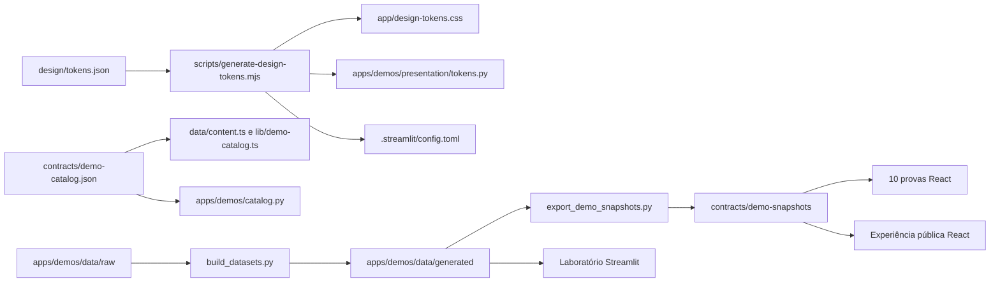

# Arquitetura

## Decisão central

Landing, demos, contratos, datasets e documentação vivem em um único
repositório. O Next.js permanece na raiz e passa a ser a camada pública de
apresentação. O aplicativo Python em `apps/demos/` é o laboratório analítico e
a origem dos cálculos exportados.

```text
portfolio-lucas-batista/
├── app/                         rotas Next.js, sitemap e robots
├── components/
│   ├── demos/                   modal e provas React
│   ├── sections/                seções da homepage
│   ├── layout/                  estrutura compartilhada
│   └── ui/                      primitives mínimos
├── data/content.ts              conteúdo editorial
├── apps/demos/
│   ├── app.py                   entrypoint Streamlit
│   ├── catalog.py               leitor do catálogo JSON
│   ├── domain/                  cálculo sem dependência de UI
│   ├── presentation/            tema, charts, mapas, tabelas e formatadores
│   ├── pages/                   composição de cada prova
│   ├── data/raw/                amostras curadas
│   ├── data/generated/          datasets determinísticos
│   ├── scripts/                 geração, export e smoke
│   └── tests/                   pytest
├── contracts/
│   ├── demo-catalog.json        identidade e publicação
│   └── demo-snapshots/          dados das âncoras
├── design/tokens.json           tokens editáveis
├── scripts/                     automação transversal
├── tests/e2e/                   Playwright
└── .artifacts/                  saídas locais ignoradas
```

## Fluxos de dados


```mermaid
flowchart LR
  T[design/tokens.json] --> G[scripts/generate-design-tokens.mjs]
  G --> CSS[app/design-tokens.css]
  G --> PY[apps/demos/presentation/tokens.py]
  G --> ST[.streamlit/config.toml]

  C[contracts/demo-catalog.json] --> NEXT[data/content.ts e lib/demo-catalog.ts]
  C --> NAV[apps/demos/catalog.py]

  RAW[apps/demos/data/raw] --> BUILD[build_datasets.py]
  BUILD --> DATA[apps/demos/data/generated]
  DATA --> EXPORT[export_demo_snapshots.py]
  EXPORT --> SNAP[contracts/demo-snapshots]
  SNAP --> PROOFS[10 provas React]
  DATA --> STREAMLIT[Laboratório Streamlit]
  SNAP --> WEB[Experiência pública React]
```

## Next.js

- `app/page.tsx` possui o `<main id="conteudo">` da homepage.
- `app/provas/[slug]/page.tsx` gera os 10 slugs públicos.
- `app/sitemap.ts` e `app/robots.ts` substituem arquivos estáticos gerados.
- `data/content.ts` é importado por Server Components; Client Components recebem
  props mínimos.
- `CaseDemoLauncher` carrega `DemoModal` apenas no primeiro clique.
- ECharts e MapLibre são importados dentro de `useEffect`, quando a prova abre.
- O modal e as rotas públicas usam o mesmo shell React, sem iframe.

### Instrumentação das provas

`ProofAnalytics` mede a jornada pública depois que `DemoShell` monta. O contrato
tem três eventos com vocabulário fechado:

| Evento            | Propriedades exatas     | Valores controlados                                           |
| ----------------- | ----------------------- | ------------------------------------------------------------- |
| `proof_open`      | `proof_slug`, `surface` | `featured_modal`, `library_modal` ou `route`                  |
| `proof_engaged`   | `proof_slug`, `surface` | mesmas superfícies; emitido após 30 s úteis em primeiro plano |
| `proof_cta_click` | `proof_slug`, `action`  | `open_full_proof` ou `contact`                                |

O tempo de engajamento acumula somente enquanto a aba está visível e a janela
tem foco; pausa em `hidden`/`blur`, não emite duração e cancela no unmount. O
aplicativo enfileira os eventos no envelope v2 mesmo antes do script carregar;
a coleta de eventos customizados depende da capacidade habilitada no plano do
provedor. O payload customizado da aplicação não adiciona texto livre, PII,
URL, referrer, identificadores, timestamp, duração exata, cookies ou storage.
Query e hash são removidos de pageviews pelo `beforeSend`.

## Streamlit

`apps/demos/app.py` usa `st.navigation` e `st.Page`. As URLs são explícitas e
derivadas do catálogo compartilhado. Pages devem apenas compor filtros,
apresentação e chamadas ao domínio.

Dependências entre camadas:

```text
pages → domain
pages → presentation
presentation → settings/tokens
domain ↛ streamlit
```

O Streamlit não define a qualidade visual pública do produto e não é carregado
pela landing. As dez provas React consomem snapshots Python validados. O
laboratório permanece útil para exploração, depuração e comparação de cenários.

## Estratégia de visualização

- ECharts: gráficos analíticos das provas React, carregados sob demanda e com
  tema único derivado dos tokens.
- MapLibre GL JS: mapas e rotas React, com estilo-base escuro e overlays
  semânticos.
- Plotly: gráficos do laboratório Python.
- Folium/Leaflet: mapas do laboratório Python.

Não será introduzido monorepo framework, CMS ou biblioteca de componentes
adicional sem ganho operacional comprovado. O repositório único já oferece a
fronteira necessária entre apresentação, contrato e domínio.

## Contratos

`DemoSnapshot` é produzido pelo Python e validado no TypeScript. React não
recalcula frete, SLA ou roteirização. Alterações de schema exigem:

1. atualizar exporter e tipos;
2. rodar `npm run demos:export`;
3. rodar `npm run demos:validate`;
4. revisar as 10 rotas públicas.

## Artefatos

| Artefato                   | Destino                       | Git |
| -------------------------- | ----------------------------- | --- |
| CV final                   | `public/lucas-batista-cv.pdf` | sim |
| export intermediário do CV | `.artifacts/cv/`              | não |
| capturas Playwright        | `.artifacts/qa/`              | não |
| relatórios Lighthouse      | `.artifacts/lighthouse/`      | não |
| resultados Playwright      | `.artifacts/playwright/`      | não |

Legado removido continua recuperável no histórico Git. Clones e relatórios
locais antigos são arquivados fora do repositório.

## Proteção contra regressão

`scripts/validate-architecture.mjs` exige a topologia acima e falha se caminhos
legados reaparecerem. A decisão completa está em
`docs/decisions/0001-single-repository.md`.
